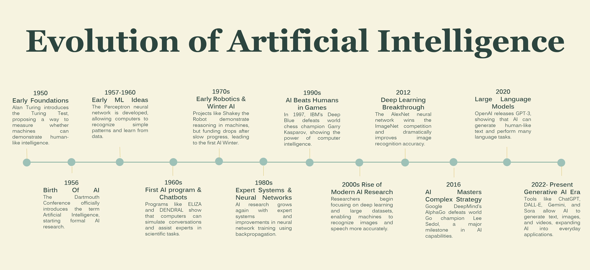

# Evolution of Artificial Intelligence Timeline

<a href="/parin-ai-portfolio/">Home</a> | 
<a href="/parin-ai-portfolio/about">About</a> | 
<a href="/parin-ai-portfolio/artifacts">Artifacts</a>

---

## Introduction

This artifact presents a timeline of major developments in artificial intelligence, from early theoretical ideas to modern generative AI systems.

---

## Description

The timeline highlights key milestones in the evolution of AI, including foundational concepts, major research breakthroughs, and recent advancements such as deep learning and generative AI. It provides a chronological view of how the field has developed over time.

---

## Objective

The objective of this artifact was to study the historical evolution of AI and understand how key breakthroughs in algorithms, computing, and data shaped the field.

---

## Process

I researched important milestones in artificial intelligence and organized them into a timeline format. The artifact includes foundational moments such as the Turing Test, the Dartmouth Conference, early neural network development, expert systems, deep learning breakthroughs, and the rise of large language models and generative AI.

---

## Tools and Technologies Used

- PowerPoint  
- Research sources  
- ChatGPT for brainstorming and organization  

---

## Key Concepts Learned

- AI has evolved through multiple phases, including symbolic AI, machine learning, and deep learning  
- Advances in computing power and data availability played a major role in AI progress  
- Neural networks and deep learning significantly accelerated modern AI development  
- Recent progress in generative AI is built on decades of research and experimentation  

---

## Value Proposition

### Unique Value

This artifact provides a clear and structured view of AI evolution, making it easier to understand how different innovations built on each other over time.

### Relevance

Understanding the history of AI helps connect past developments to current technologies and provides context for future advancements in machine learning and artificial intelligence.

---

## Artifact Evidence

---

## Download Timeline

[Download the AI Timeline Presentation](../assets/ai-timeline.pptx)

---

## References

- Course materials on AI history  
- Public resources on major AI milestones  

*Note: ChatGPT was used only for organizing and refining the content.*
