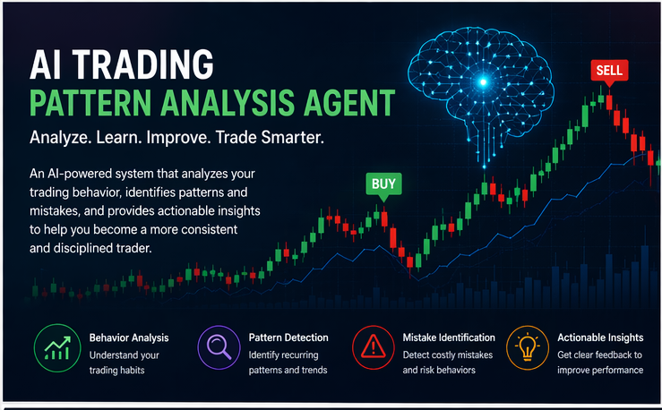
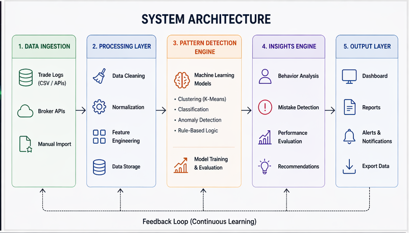
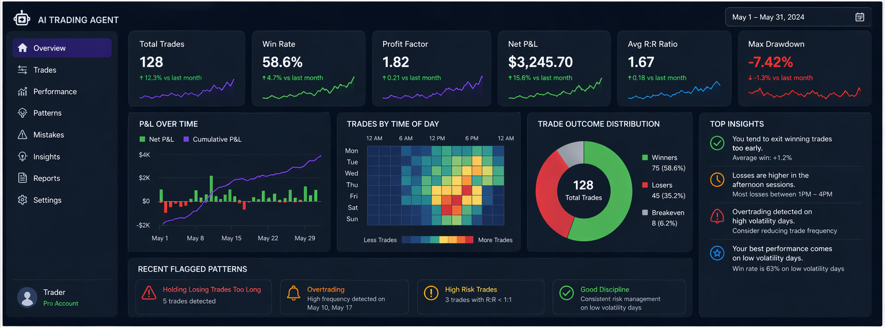

# Artifact 5: AI Trading Pattern Analysis Agent

<a href="/parin-ai-portfolio/">Home</a> | 
<a href="/parin-ai-portfolio/about">About</a> | 
<a href="/parin-ai-portfolio/artifacts">Artifacts</a>

---

## Overview

This project focuses on designing an AI-based system that analyzes personal trading behavior and identifies patterns, mistakes, and opportunities for improvement. Instead of only tracking profit and loss, this system helps understand *why* certain decisions lead to success or failure.

The goal is to move from emotional or reactive trading to more data-driven and disciplined decision-making.

---

## Problem Statement

Most traders review outcomes (profit/loss), but not behavior patterns. This leads to repeated mistakes such as:

- Overtrading
- Panic selling
- Holding losing positions too long
- Ignoring risk management rules

There is no simple system that continuously analyzes trading behavior and provides actionable feedback.

---

## Proposed Solution

The AI Trading Pattern Analysis Agent processes historical trade data and identifies behavioral patterns using a combination of rule-based logic and machine learning.

It answers questions like:

- Do I tend to sell too early?
- Am I taking excessive risks on certain days?
- Are losses happening under similar conditions?

---

## System Architecture

### Components:

1. **Data Ingestion Layer**
   - Input: Trade logs (CSV, broker APIs)
   - Fields: Entry price, exit price, timestamps, position size

2. **Processing Layer**
   - Data cleaning and normalization
   - Feature extraction

3. **Pattern Detection Engine**
   - Rule-based logic + ML models

4. **Insights Engine**
   - Generates feedback and recommendations

---

## Algorithms and Techniques

### 1. Feature Engineering

Key features derived from raw data:

- Holding time
- Profit/loss per trade
- Risk-to-reward ratio
- Trade frequency
- Time-of-day behavior

---

### 2. Clustering (Behavior Segmentation)

- Algorithm: K-Means Clustering  
- Purpose: Group trades into behavior categories  

Example:
- Cluster 1 → Quick profitable trades  
- Cluster 2 → Long losing trades  
- Cluster 3 → High-risk trades  

---

### 3. Classification (Mistake Detection)

- Models: Logistic Regression / Decision Trees  
- Purpose: Predict if a trade is likely a “bad decision”

---

### 4. Anomaly Detection

- Technique: Isolation Forest  
- Purpose: Identify unusual trades (e.g., sudden large losses)

---

### 5. Rule-Based Logic

Used alongside ML for clear signals:

- If holding time > threshold AND loss → flag “holding too long”
- If > X trades/day → flag “overtrading”

---

## Example Output

Sample insights:

- “You tend to exit winning trades too early (avg profit: +1.2%)”
- “Losses are higher in afternoon trading sessions”
- “Overtrading detected on high volatility days”

---

## Value Proposition

### For Individual Traders:
- Improves discipline and consistency  
- Reduces emotional decision-making  
- Provides clear, actionable insights  

### For Platforms / Fintech:
- Can be integrated into trading apps  
- Enhances user engagement  
- Adds AI-driven advisory features  

---

## Technical Strengths

- Combines rule-based + ML approach (practical design)
- Scalable architecture (can handle large trade datasets)
- Extensible to real-time analysis using streaming systems

---

## Future Improvements

- Real-time trade feedback using streaming (Kafka / Event Hubs)
- Reinforcement learning for strategy optimization
- Integration with brokerage APIs for live insights
- Personalized risk scoring system

---

## Reflection

This project reflects my interest in applying AI to real-world behavioral problems rather than just theoretical models. It combines my background in distributed systems with machine learning concepts to design a practical and scalable solution.

It also shows how AI can go beyond prediction and actually help improve human decision-making over time.

---

<a href="/parin-ai-portfolio/">Home</a> | 
<a href="/parin-ai-portfolio/about">About</a> | 
<a href="/parin-ai-portfolio/artifacts">Artifacts</a>

