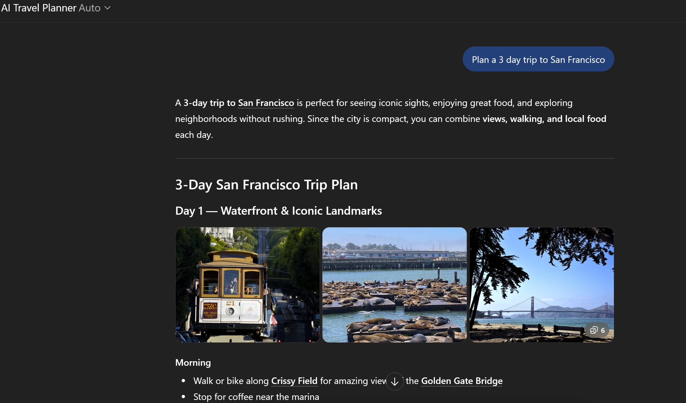

# AI Travel Planner Assistant

<a href="/parin-ai-portfolio/">Home</a> | 
<a href="/parin-ai-portfolio/about">About</a> | 
<a href="/parin-ai-portfolio/artifacts">Artifacts</a>

---

## Introduction

This artifact demonstrates the concept of an AI-powered travel planning assistant that helps users generate itineraries and travel recommendations based on their preferences.

---

## Description

The AI Travel Planner is designed to create personalized travel plans based on user inputs such as destination, travel duration, budget, travel style, and interests. It shows how generative AI can be used to provide practical recommendations in a real-world scenario.

---

## Objective

The objective of this artifact was to explore how generative AI can support practical decision-making and personalized travel planning.

---

## Process

I designed the concept around prompt-driven AI interactions where the system takes user inputs such as destination, travel duration, budget, travel style, and interests, and generates a suggested travel plan.

The focus was on creating a simple and user-friendly experience that demonstrates how AI can be applied to a real-world use case.

---

## Tools and Technologies Used

- ChatGPT  
- Prompt engineering  
- AI-based interaction workflows  

---

## Key Concepts Learned

- Generative AI can create personalized outputs based on user input  
- Prompt design plays a key role in improving response quality  
- AI systems can simplify decision-making in everyday scenarios  
- User experience is important when designing AI-driven applications  

---

## Value Proposition

### Unique Value

This artifact demonstrates how generative AI can be applied to build a practical, user-focused application that provides personalized recommendations.

### Relevance

AI-powered assistants are widely used across industries, and this artifact shows a real-world use case of applying AI to improve user experience and planning.

---

## Artifact Evidence

---

## Live Demo

You can try the AI Travel Planner here:

[Open AI Travel Planner](https://chatgpt.com/g/g-69b5ffaa4c908191a216c6d9e799b258-ai-travel-planner)

---

## References

- Course materials on AI applications  
- ChatGPT (GPT Builder)  

*Note: ChatGPT was used to build and test the assistant. The concept, prompts, and structure are based on my own design.*

---

<a href="/parin-ai-portfolio/">Home</a> | 
<a href="/parin-ai-portfolio/about">About</a> | 
<a href="/parin-ai-portfolio/artifacts">Artifacts</a>

