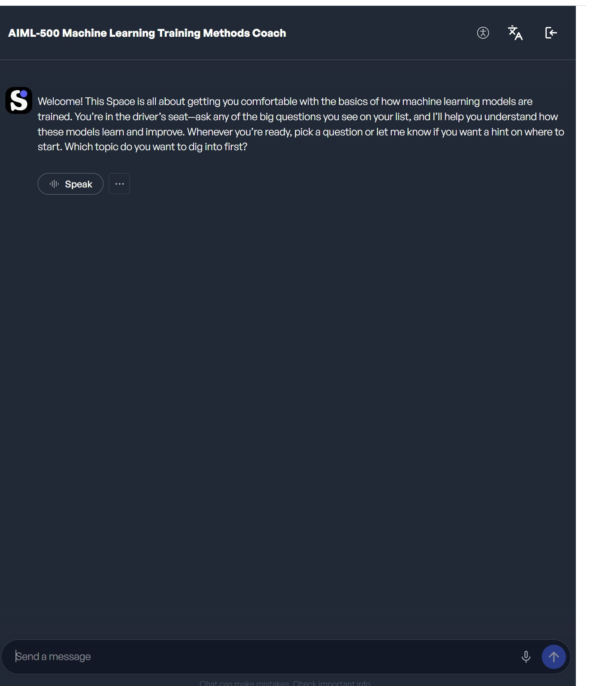

# Machine Learning Training Methods (Chatbot Interaction)

## Introduction

This artifact is based on an interactive activity where I worked with an AI chatbot to understand different training methods used in machine learning.

## Objective

The objective of this activity was to learn how machine learning models are trained, including concepts such as supervised learning, unsupervised learning, and reinforcement learning.

## Process

In this activity, I used a chatbot to explore machine learning training methods by asking a series of questions.

I asked questions such as:

- How does a supervised learning model learn from the training data?  
- What is the main approach used to train models in unsupervised learning?  
- In reinforcement learning, how does an agent learn the best actions to take?  
- Why are algorithms important in the training of machine learning models?  
- What are the basic steps involved in training a machine learning model?  
- How does repetition (iterating over data) help in training a model?  
- What is the role of examples (data) in training a machine learning model?  

Along with these, I also asked additional follow-up questions to understand the concepts more deeply.

The chatbot responded with explanations and examples, and in some cases asked questions back to check my understanding. This made the interaction feel more like a conversation rather than just a question-and-answer activity.

Overall, the process helped me better understand how different training methods work by actively thinking through the questions instead of just reading the material.

## Tools Used

- AI Chatbot (Machine Learning Training Methods Coach)
- Course materials

## Key Concepts Learned

- Supervised learning uses labeled data to train models.
- Unsupervised learning finds patterns in data without labels.
- Reinforcement learning learns through rewards and feedback.
- Training a model involves multiple iterations over data.
- Data plays a key role in how well a model performs.

## Value Proposition

This artifact shows my ability to learn AI concepts through interaction and apply reasoning instead of just memorizing theory. It also demonstrates how AI tools can be used to support learning and problem-solving.

## Artifact Evidence

This screenshot shows part of my interaction with the chatbot during the activity.
