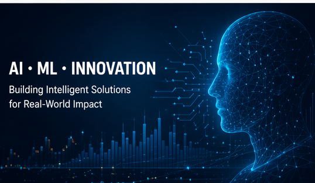

# Parin Shah

Senior Staff Software Engineer  
Distributed Systems • Data Platforms • Artificial Intelligence

San Francisco Bay Area

---

## What I Build

I design and build large-scale data and platform systems that power analytics, automation, and intelligent decision-making.

My work spans:

- Distributed systems and backend platforms
- Real-time data streaming and event processing
- Data pipelines and analytics infrastructure
- Artificial intelligence and AI-powered applications

---

## Impact

- Architected systems processing petabytes of data
- Enabled platforms supporting $2B+ in annual product shipments
- Delivered $200M+ in operational cost savings

---

## Professional Summary

I am a Senior Staff Software Engineer with over 13 years of experience designing enterprise-scale distributed systems, backend platforms, and real-time data pipelines. My work has focused on building fault-tolerant, high-performance systems that process large volumes of data and support mission-critical operations.

I am expanding my expertise in artificial intelligence and machine learning through graduate coursework at Indiana Wesleyan University. This portfolio highlights selected AIML-500 artifacts and shows how AI concepts connect with large-scale data and platform engineering.

---

## Portfolio Artifacts

### [Evolution of Artificial Intelligence Timeline](artifacts/ai-timeline)
A timeline showing major milestones in the development of artificial intelligence, from early theoretical foundations to the modern generative AI era.

### [AI Travel Planner Assistant](artifacts/ai-travel-planner)
A concept artifact showing how generative AI can be applied to practical travel planning by creating personalized itineraries and recommendations.

---

## Featured Projects

### 🧠 Evolution of Artificial Intelligence Timeline
A visual timeline explaining the major milestones that shaped modern artificial intelligence — from the Turing Test and early neural networks to deep learning and generative AI.

➡️ [View Project](artifacts/ai-timeline)

---

### ✈️ AI Travel Planner Assistant
A generative AI application concept that helps users create personalized travel itineraries based on preferences such as location, duration, and interests.

➡️ [View Project](artifacts/ai-travel-planner)
